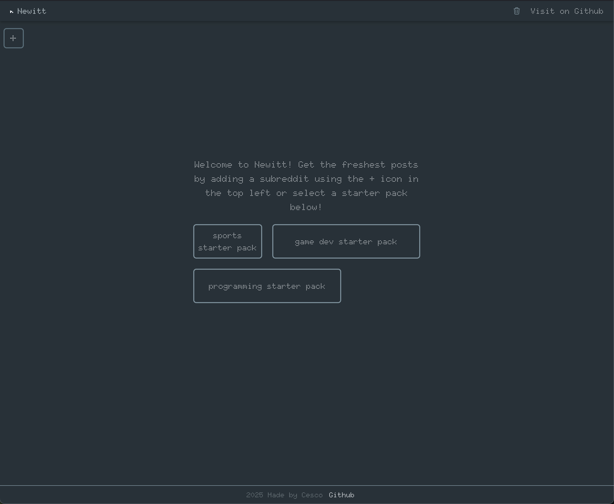
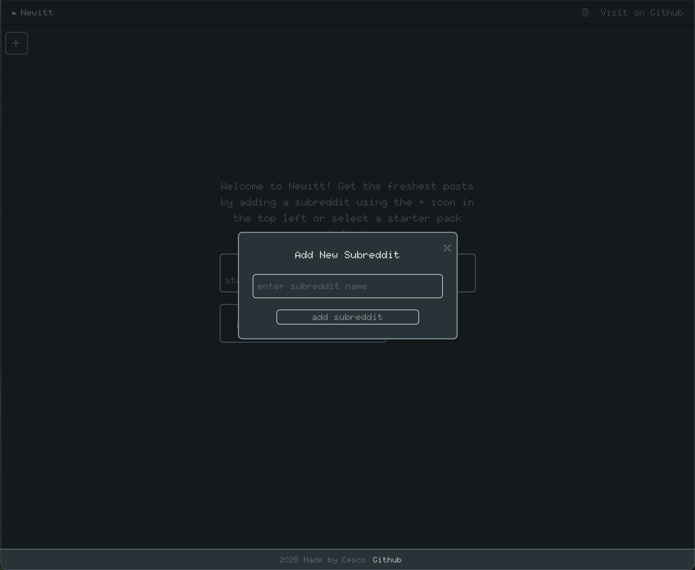
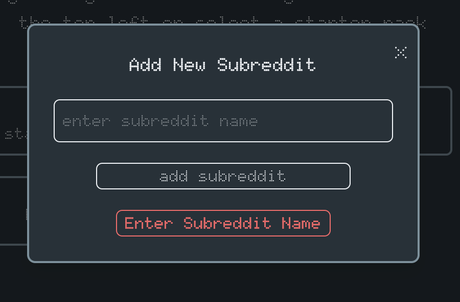
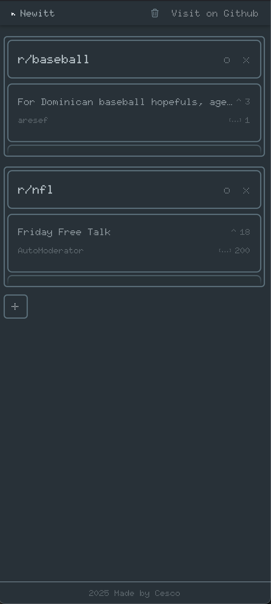
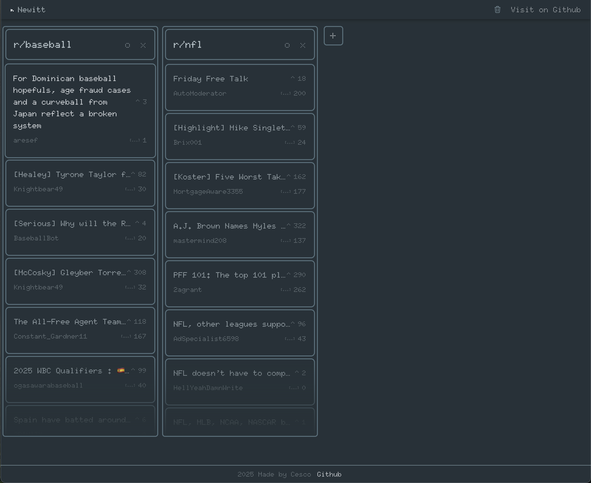
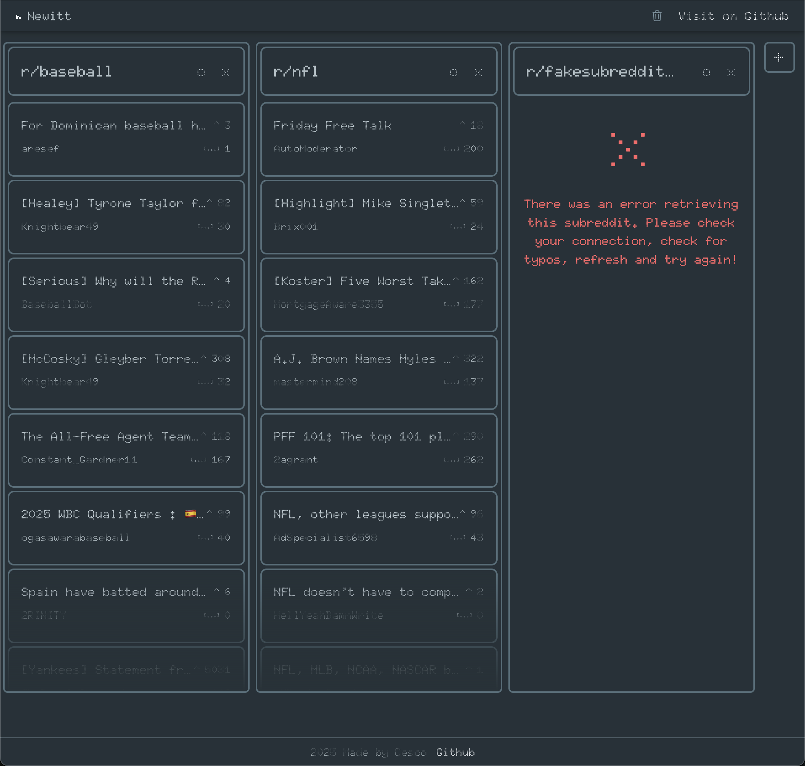

# Newitt (Reddit Client Project)

This is my minimalist reddit client called Newitt based on the mockup and [project from roadmap.sh](https://roadmap.sh/projects/reddit-client). This browser-based reddit client loads the newest content from
a predefined group of subreddits or individually selected subreddits into individual, responsive and dynamic lanes. 
<br>
<br>
Live Demo: https://newitt-project.pages.dev/ 

## How it was made:

**Tech used:** React, Vite, TailwindCSS, reddit API, Google Fonts (Doto), HeroIcons

This project was created in React, set up through vite. It uses TailwindCSS, Google Fonts (doto), and HeroIcons (trash bin), for styling. Content is fetched directly 
from the reddit API.

## Visual Examples
<br> The Initial Screen <br>



<br> The Modal <br>



<br> Modal Error Example <br>



<br> Mobile Responsive Example <br>



<br> User selected lanes example <br>



<br> Error lane example <br>



## How To Run The Project

1. Download or clone the repo onto your local environment, and navigate into the folder
```
git clone https://github.com/cescosgames/newitt_project.git
cd newitt_project
```
2. Install dependencies
```
npm install
```
3. Run the dev server
```
npm run dev
```
4. Go to your selected local host in your browser (Vite default is 5173)

## Features:

Following the project guidelines, this project features...
1. The ability to handle loading states while fetching data and displays error messages for invalid subreddits or API issues
2. Provides a smooth user experience when adding or removing lanes for both desktop and mobile
3. Uses local storage to automatically save user's custom lanes and restore them when application is reloaded.
4. Users can add or remove new subreddit lanes and each lane will show the 10 newest posts including title, author, upvotes, and comments
5. Each lane can be refreshed and each post can be clicked to take you directly to the source

## Lessons Learned:

This was the biggest roadmap project so far and it was incredibly fun to make! This project was built in this process: 
1. Initial project set up and design using vite to set up the project, and tailwindCSS to style the project. 
Once the lanes and general mockup were fully designed, I moved onto setting up our fetch system.
2. The fetch system was a simple try/catch block that used the reddit api to get the 10 newest posts from a given subreddit. 
For intial testing, I used baseball and had each lane represent baseball.
3. Once we were fetching data properly, I moved on to adding and removing lanes. Refreshing was straightforward because it was just using our fetch function again.
4. To add lanes dynamically, we needed to set the modal up. The modal was a simple modal that just featured an input field. Spent longer than planned here adding
the option to escape and enter out of the modal and also auto focus when opening. The auto focus felt great to implement.
5. Once lanes were being added and removed correctly that was essentially the end of the project so I had the chance to improve on the project overall. 
This was a fun process and this is where I added the starter packs idea, animation transitions, and funny enough mobile responsiveness. I hadn't added
mobile responsiveness until the very end! Fortunately with tailwind, it was incredibly simple. 
<br>
Overall, this was a really great project to implement a lot of what I've learned in React so far. I learned a lot of new useful concepts along the way as well
(like auto focusing on the modal) and got the experience of taking a real project from start to finish. I will be deploying it soon and it might already be deployed by the 
time you read this! 
<br>
I tried to comment out my thought process and approach throughout the entire project so I hope you will find explanations to any questions you may have in the code itself.
If you notice anything incorrect or done poorly, please let me know! I'd love to improve and learn from my mistakes.
<br>
Finally, every project has room for improvement, and with this project, if I were to revisit, I would clean up the project structure entirely. I ended up handling the
addition and removal of lanes directly in the my App.jsx file and it made the main App.jsx quite messy. This could have been avoided if I had planned better at the start, 
but seeing as it's completely functional, I decided not to restructure the project in this version. In the future, I would have all the lane additions/removals as their own
component inside the main App.jsx to bring more clarity and tidyness to the project.
<br>
Thanks for checking this project out!